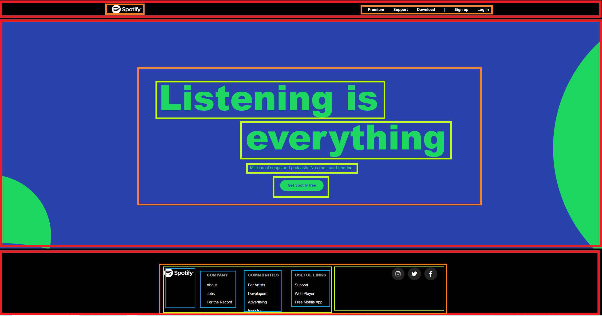

# Spotify Homepage Replica using HTML and CSS
This project is a replica of the Spotify homepage as of 2021, created using HTML and CSS. It uses Font Awesome icons for the social media logos, such as Instagram, Twitter, and Facebook.

## Live Site

This project is now hosted on Netlify. You can view the live site at [https://spotify-homepage-rsp0225.netlify.app/](https://spotify-homepage-rsp0225.netlify.app/).

## Approach
To replicate the Spotify homepage, I first used Google Chrome's Inspect feature to analyze the structure and styles of the original page - Spotify. I then decided to break it down into three main components: 

- Navbar: This section includes includes the Spotify logo and links to premium, support, download, and sign up and log in.
- Main: The section contains a slogan, sub-slogan, and button.
- Footer: The footer section includes links to other Spotify services as well as social media links.

## Installation

1. Clone the repository to your local machine.
2. Open the `index.html` file in a web browser like Google Chrome.

## Usage

This project is a static website replica of the Spotify homepage and for educational and learning purposes only. You can interact with it in the same way you would with the original Spotify homepage.

## Credits

- The live site for this project is hosted on Netlify, a cloud computing company that provides a serverless environment for web development projects.
- The Font Awesome icons used in the project were sourced from [fontawesome.com](https://fontawesome.com).
- The original Spotify homepage was used as a reference for the project.

## Author

Created by [rsp0225].
